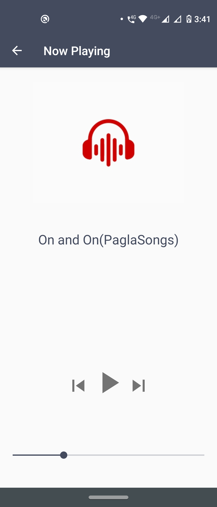

# MediaPlayer

####

An Android Application developed as a part of Skills Development Laboratory (SDL) which stores all .mp3 & .wav files in your mobile in a list & plays the files.
Functionalities in the app include Pause, Play, Previous & Next.

